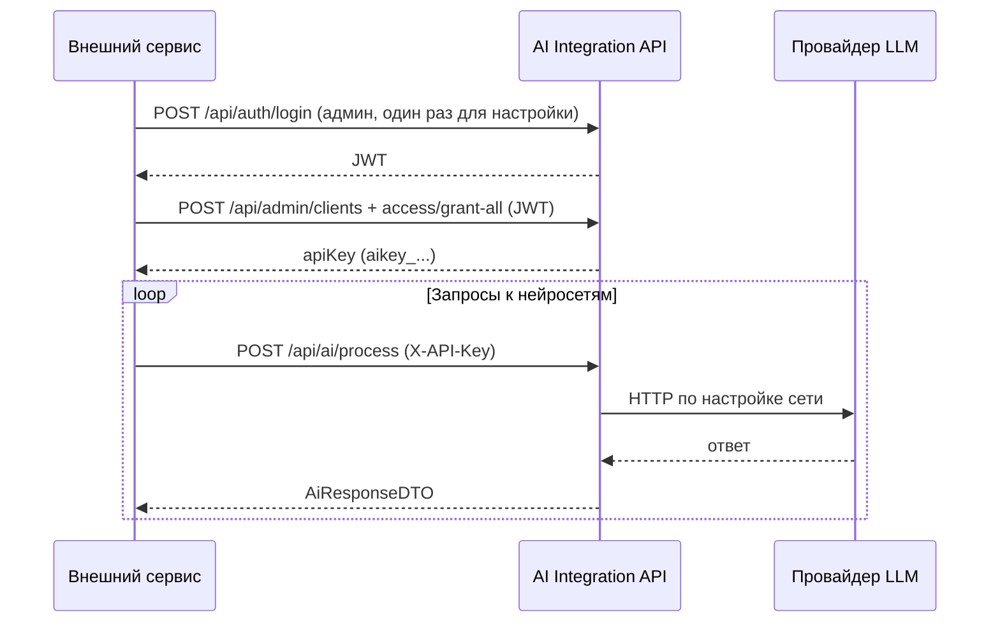

# Руководство для разработчиков и аналитиков: интеграция внешнего сервиса с AI Integration Service

Документ описывает **фактический контракт** backend-а в этом репозитории (`com.example.integration`). Предполагается, что внешний сервис вызывает HTTP API по сети (не обязательно из браузера).

**Базовый URL** далее обозначается как `{BASE_URL}` (например `http://localhost:8091` или `https://ai.example.com`). Порт по умолчанию в конфигурации: **8091** (`server.port` / `SERVER_PORT`).

---

## 1. Две модели безопасности

| Роль | Как доказываем личность | Типичное использование |
|------|---------------------------|-------------------------|
| **Администратор** | Заголовок **`Authorization: Bearer <JWT>`** после входа | CRUD нейросетей, клиентов, доступов, просмотр логов |
| **Клиентское приложение** (ваш сервис) | Заголовок **`X-API-Key: <ключ>`** | Вызов **`/api/ai/**`** — запросы к нейросетям |

Важно:

- Ключ клиента **не** заменяет логин администратора. Для первичной настройки (создать клиента, выдать доступ к сетям) нужен **JWT админа**.
- Префикс ключа в коде: **`aikey_`** + случайная строка (см. `ClientManagementService`).

---

## 2. Администратор: получение JWT

### 2.1. Вход

```http
POST {BASE_URL}/api/auth/login
Content-Type: application/json

{
  "username": "admin",
  "password": "admin"
}
```

**Ответ 200** (тело, класс `AdminAuthResponse`):

```json
{
  "token": "<JWT>",
  "username": "admin",
  "email": "admin@example.com"
}
```

Дальше для всех запросов к **`/api/admin/**`**:

```http
Authorization: Bearer <JWT>
```

### 2.2. Регистрация первого администратора

`POST {BASE_URL}/api/auth/register` с тем же телом `{ "username", "password" }` — **срабатывает только если в БД ещё нет администраторов**. Иначе вернётся ошибка (400 с пояснением).

### 2.3. Swagger UI

- UI: `{BASE_URL}/swagger-ui/index.html` (или редирект с `/swagger-ui.html`).
- OpenAPI JSON: `{BASE_URL}/v3/api-docs`.

В Swagger для админских операций используйте схему **Bearer JWT** (получите токен через `POST /api/auth/login`, затем Authorize → вставьте **`Bearer <token>`** целиком или только токен — см. `SWAGGER_AUTH_GUIDE.md` в корне репозитория).

---

## 3. Настройка для нового внешнего сервиса (порядок шагов)

1. **Войти** как админ (раздел 2).
2. **Создать клиента** (ваш сервис — отдельная запись «приложение»):

```http
POST {BASE_URL}/api/admin/clients
Authorization: Bearer <JWT>
Content-Type: application/json

{
  "name": "my-service",
  "description": "Описание для админки"
}
```

В ответе (`ClientAppDTO`) будет поле **`apiKey`** — это значение для **`X-API-Key`** (сохраните в секретах окружения вызывающего сервиса).

3. **Выдать клиенту доступ к нейросетям** (иначе оркестратор не найдёт доступную сеть для типа запроса):

   - **Ко всем активным сетям сразу** (удобно для стенда):

```http
POST {BASE_URL}/api/admin/access/grant-all/{clientId}
Authorization: Bearer <JWT>
```

   Здесь `{clientId}` — UUID из шага 2.

   - Либо точечно: `POST {BASE_URL}/api/admin/access` с телом `GrantAccessRequest` (clientId, networkId, лимиты) — см. Swagger и `NetworkAccessController`.

4. Убедиться, что в БД **есть активные нейросети** с заполненными URL/ключами провайдера (`GET /api/admin/networks`).

После этого ваш сервис может вызывать **`/api/ai/process`** с **`X-API-Key`**.

---

## 4. Клиентское API: обязательные заголовки

```http
X-API-Key: aikey_xxxxxxxx
Content-Type: application/json
```

Без валидного ключа активного клиента Spring Security вернёт **401** для путей `/api/ai/**` (после фильтрации `ApiKeyAuthFilter`).

Особенность: если одновременно передан **`Authorization: Bearer ...`** (JWT), фильтр API-ключа **не подменяет** контекст — для клиентских вызовов используйте **только** `X-API-Key`, без Bearer, чтобы не получить неожиданное поведение.

---

## 5. Основные эндпоинты для интеграции

| Метод | Путь | Авторизация | Назначение |
|-------|------|-------------|------------|
| POST | `/api/ai/process` | `X-API-Key` | Основной вызов нейросети |
| GET | `/api/ai/networks/available` | `X-API-Key` | Список сетей, доступных **этому** клиенту (с учётом `client_network_access`) |
| GET | `/api/ai/networks/{networkId}/available` | `X-API-Key` | Проверка доступа (в коде идентификатор — **логическое имя** сети, см. §6) |
| GET | `/api/ai/networks/{networkId}/limits` | `X-API-Key` | Лимиты для сети |
| GET | `/api/ai/health` | `X-API-Key` | Текстовый health (в `SecurityConfig` весь `/api/ai/**` требует аутентификации) |
| POST | `/api/social/posts` | `X-API-Key` | Публикация поста в Telegram, Facebook или X; для Telegram поддержаны файлы/медиа |

**Проверка живости без ключа** (для балансировщиков):

```http
GET {BASE_URL}/actuator/health
```

---

## 6. Тело запроса `POST /api/ai/process`

Тип: **`AiRequestDTO`** (JSON).

| Поле | Обязательность | Описание |
|------|------------------|----------|
| `userId` | Да | Строковый ID конечного пользователя **во внешней системе** (для лимитов и логов; внутри создаётся/находится `ExternalUser`). |
| `networkName` | Нет | **Имя** нейросети (`NeuralNetwork.name`), например `openai-gpt4`. Если **null/пусто** — автоматический выбор среди сетей, доступных клиенту, с фильтром по **`requestType`**. |
| `requestType` | Условно | Например: `chat`, `transcription`, `speech_synthesis`, `embedding`, `image_generation`, `video_generation` — должен соответствовать типу выбранной/найденной сети. |
| `payload` | Да | Произвольный JSON-объект; формат **зависит от провайдера** (см. §7). |
| `metadata` | Нет | Строковый map для своих пометок. |

**Важно про пути с `{networkId}`:** в `AiOrchestrationService` для проверок используется **`findByName(networkId)`** — то есть в URL ожидается **не display name**, а поле **`name`** из админки (то же значение, что в `networkName` в process).

---

## 7. Формат `payload` по типам (практика в коде)

### 7.1. Чат (`requestType`: `chat`)

Обычно передаётся структура в духе OpenAI Chat Completions, например:

```json
{
  "messages": [
    { "role": "user", "content": "Привет!" }
  ]
}
```

Точная схема зависит от выбранного клиента (`OpenAIClient`, `YandexGptClient`, …).

### 7.2. Транскрипция Whisper (`requestType`: `transcription`)

Клиент `WhisperClient` ожидает в `payload`:

- **`audio`** — строка **Base64** сырых байт аудио;
- опционально **`language`**, **`prompt`**.

Пример минимального фрагмента:

```json
{
  "audio": "<BASE64>",
  "language": "ru"
}
```

### 7.3. Синтез речи OpenAI TTS (`requestType`: `speech_synthesis`)

В админке у нейросети: **`provider`**: `openai`, **`networkType`**: `speech_synthesis`, **`apiUrl`**: база OpenAI (как у чата), например `https://api.openai.com/v1`, **`modelName`**: по умолчанию `tts-1` или `tts-1-hd` (можно переопределить в `payload.model`).

Клиент: `OpenAiClient` → HTTP `POST /v1/audio/speech`. Используется тот же API-ключ OpenAI, что и для остальных моделей OpenAI.

В **`payload`**:

| Поле | Обязательность | Описание |
|------|----------------|----------|
| `input` или `text` | Да | Текст для озвучки |
| `voice` | Нет | Голос: `alloy`, `echo`, `fable`, `onyx`, `nova`, `shimmer` (и другие, поддерживаемые OpenAI) |
| `response_format` | Нет | Например `mp3`, `opus`, `aac`, `flac`, `wav`, `pcm` (по умолчанию в коде: `mp3`) |
| `model` | Нет | Переопределение модели TTS, если не хватает `modelName` в нейросети |

Ответ в `response`: объект с полем **`audioBase64`** (аудио в Base64), **`format`**, **`voice`**, **`model`**.

### 7.4. Синтез речи Yandex SpeechKit (`requestType`: `speech_synthesis`)

В **документации Yandex Cloud** синтез речи относится к продукту **SpeechKit TTS** (сервис синтеза речи). Отдельного идентификатора «модели» в формате YandexGPT (`gpt://.../latest`) для TTS **нет**: задаются **язык** (`lang`), **голос** (`voice`) и **формат** аудио. Доступны **REST API v1** (`speech/v1/tts:synthesize`) и **API v3** (gRPC/REST); в этом сервисе реализован вызов **REST v1** по умолчанию `https://tts.api.cloud.yandex.net/speech/v1/tts:synthesize`.

В админке: **`provider`**: `yandex`, **`networkType`**: `speech_synthesis`, **`apiUrl`**: можно оставить URL от YandexGPT — для TTS он будет проигнорирован и подставится endpoint SpeechKit (если в `apiUrl` не указан полный путь с `tts:synthesize`). **`modelName`** для TTS не используется так же, как для GPT; голос задаётся в запросе.

Подключение: **тот же API-ключ Yandex Cloud**, что и для Yandex GPT (`Authorization: Api-Key`).

В **`payload`**:

| Поле | Обязательность | Описание |
|------|----------------|----------|
| `text` или `input` | Да | Текст для синтеза |
| `voice` | Нет | Идентификатор голоса SpeechKit, напр. `alena`, `filipp`, `ermil`, `jane`, … (см. [список голосов](https://yandex.cloud/ru/docs/speechkit/tts/voices)) |
| `lang` | Нет | Язык, напр. `ru-RU`, `en-US` (по умолчанию `ru-RU`) |
| `format` | Нет | `oggopus`, `lpcm`, `mp3`, … (по умолчанию `oggopus`) |

Ответ в `response`: **`audioBase64`**, **`format`**, **`lang`**, **`voice`**.

### 7.5. Virtual try-on (`requestType`: `image_generation` или `video_generation`)

Сценарий: **ваше фото человека + фото вещи → тот же человек в этой вещи** (фото или видео).

| Сеть | Тип | Результат |
|------|-----|-----------|
| `fashn-tryon-max` | `image_generation` | Фото (FASHN tryon-max) |
| `fashn-tryon-video` | `video_generation` | Видео 5–10 с (tryon-max → image-to-video) |
| `kling-kolors-tryon` | `image_generation` | Фото (Kling Kolors) |
| `kling-tryon-video` | `video_generation` | Видео (Kling try-on → image2video) |

`fashn-product-to-model` — **не** для вашего сценария: генерирует новую модель с flat-lay, а не надевает вещь на вашего человека.

Для Kling в админке у сети `provider = kling` указываются два секрета провайдера: `apiKey` = Kling Access Key, `apiSecret` = Kling Secret Key. Для международного API используется базовый URL `https://api-singapore.klingai.com`. Клиентские приложения по-прежнему передают только `X-API-Key` сервиса интеграции; JWT для Kling (`iss=Access Key`, HS256 подпись `Secret Key`) формируется внутри `KlingVirtualTryOnClient`.

Обязательный **`payload`**:

| Поле | Описание |
|------|----------|
| `personImageBase64` | Фото вашего человека (base64 или data URI) |
| `garmentImageBase64` | Фото вещи с карточки/flat-lay |
| `prompt` | Опционально: «open jacket», поза, фон |
| `durationSec` / `duration` | Для видео: 5 или 10 |
| `videoResolution` | FASHN: `480p`, `720p`, `1080p` |
| `outputMode: "video"` | Альтернатива: на фото-сети можно передать `"video"` для двухшагового пайплайна |

Ответ: `imageBase64` (фото) или `videoBase64` (видео), плюс `tokensUsed` / `creditsUsed`.

### 7.6. Прочие типы

`embedding`, `image_generation`, `video_generation` — смотрите соответствующий `*Client.java` и настройки сети в админке (`apiUrl`, `modelName`, маппинги).

---

## 8. Ответ `AiResponseDTO`

Основные поля:

| Поле | Описание |
|------|----------|
| `requestId` | UUID строкой — id записи в логах |
| `status` | `success`, `failed`, при лимитах может быть сценарий с сообщением об ограничении |
| `networkUsed` | **`name`** использованной нейросети |
| `response` | JSON-объект от провайдера (как вернул клиент) |
| `errorMessage` | При ошибке |
| `executionTimeMs` | Время выполнения |
| `tokensUsed` | Если удаётся извлечь из ответа |
| `usageLimitInfo` | Остатки/период (часть логики завязана на `RateLimitService`) |

---

## 9. Ошибки и коды

- **401** — нет или неверный **`X-API-Key`** (или неактивный клиент).
- **403** — у Spring Security для неподходящей роли / запрещённый путь (`anyRequest().denyAll()` для прочих URL).
- **400** — ошибки валидации или бизнес-проверок (например «Network not found» при неверном `networkName`).
- Сообщения о лимитах подписок/квот могут приходить в **`status: failed`** с текстом в **`errorMessage`** без HTTP 429 — ориентируйтесь на тело **`AiResponseDTO`**.

---

## 10. Переменные окружения вызывающего сервиса (рекомендуемые)

```env
AI_INTEGRATION_BASE_URL=https://your-host:8091
AI_INTEGRATION_API_KEY=aikey_...
```

Таймауты HTTP-клиента на стороне вызывающего сервиса лучше ставить **не меньше** типичного времени ответа LLM (десятки секунд).

---

## 11. Пример: полный сценарий через curl

Переменные: `BASE`, `JWT`, `API_KEY`.

```bash
# 1) Логин админа
curl -s -X POST "$BASE/api/auth/login" \
  -H "Content-Type: application/json" \
  -d '{"username":"admin","password":"admin"}'

# 2) Создать клиента (подставить JWT)
curl -s -X POST "$BASE/api/admin/clients" \
  -H "Authorization: Bearer $JWT" \
  -H "Content-Type: application/json" \
  -d '{"name":"integration-test","description":"from docs"}'

# 3) Выдать доступ ко всем сетям (подставить client UUID)
curl -s -X POST "$BASE/api/admin/access/grant-all/$CLIENT_ID" \
  -H "Authorization: Bearer $JWT"

# 4) Вызов AI
curl -s -X POST "$BASE/api/ai/process" \
  -H "X-API-Key: $API_KEY" \
  -H "Content-Type: application/json" \
  -d '{
    "userId": "external-user-1",
    "networkName": "<name из админки>",
    "requestType": "chat",
    "payload": { "messages": [ { "role": "user", "content": "ping" } ] }
  }'
```

---

## 12. Публикация постов в соцсети

Endpoint:

```http
POST {BASE_URL}/api/social/posts
X-API-Key: aikey_xxxxxxxx
Content-Type: application/json
```

Общий формат одного запроса со всем постом:

```json
{
  "userId": "external-user-1",
  "platform": "telegram",
  "text": "Текст поста",
  "credentials": {
    "botToken": "<telegram bot token>",
    "chatId": "<telegram chat id>"
  },
  "attachments": [
    {
      "type": "image",
      "fileName": "photo.jpg",
      "contentType": "image/jpeg",
      "base64": "<BASE64>"
    },
    {
      "type": "document",
      "fileName": "report.pdf",
      "contentType": "application/pdf",
      "base64": "<BASE64>"
    }
  ],
  "options": {
    "parseMode": "HTML"
  }
}
```

`text` может быть пустым, если есть `attachments[]`; тогда будет опубликован только файл/медиа. Для Telegram `text` используется как caption первого вложения, если у самого вложения не задан `caption`.

Поддерживаемые платформы:

| platform | credentials | attachments | options |
|----------|-------------|-------------|---------|
| `telegram` | `botToken`, `chatId` | `image`/`photo`, `video`, `document`/`file`; `base64` или `url` | `parseMode`, `disableWebPagePreview` |
| `facebook` | `accessToken`, `pageId` | пока не поддержаны; при `attachments[]` вернётся `failed` | `link` |
| `x` | `bearerToken` | пока не поддержаны; при `attachments[]` вернётся `failed` | `replyToTweetId` |

Формат элемента `attachments[]`:

| Поле | Обязательность | Описание |
|------|----------------|----------|
| `type` | Да | `image`/`photo`, `video`, `document`/`file`. |
| `fileName` | Желательно для `base64` | Имя файла в multipart-загрузке. |
| `contentType` | Нет | MIME-тип для клиента/логов; содержимое файла по нему не валидируется. |
| `base64` или `url` | Да, ровно одно | Содержимое файла в Base64 (допускается `data:*;base64,...`) или публичный URL, если провайдер умеет загрузку по URL. |
| `caption` | Нет | Caption конкретного файла. Если не задан, для первого вложения используется общий `text`. |

Для Telegram:

- без `attachments[]` вызывается `sendMessage`;
- одно изображение/видео/документ отправляется через `sendPhoto`, `sendVideo` или `sendDocument`;
- несколько вложений отправляются через `sendMediaGroup`;
- наборы больше 10 элементов разбиваются на несколько групп, т.к. это ограничение Telegram Bot API;
- документы отделяются от фото/видео при групповой отправке, чтобы соответствовать ограничениям Telegram.

Секреты из `credentials` используются только для транзитного HTTP-вызова провайдера и **не сохраняются** в `request_logs`; в лог пишутся только имена переданных credential-полей. Результаты логируются с `request_type = social_post:<platform>`.
Содержимое `attachments[].base64` и полный `attachments[].url` также не сохраняются; в логах остаются только метаданные (`type`, `fileName`, `contentType`, источник вложения).

Ответ:

```json
{
  "requestId": "<uuid>",
  "status": "success",
  "platform": "telegram",
  "providerPostId": "42",
  "response": {},
  "errorMessage": null,
  "executionTimeMs": 123
}
```

Админская статистика для фронта:

```http
GET {BASE_URL}/api/admin/social/stats
Authorization: Bearer <JWT>
```

---

## 13. Связь с пользовательским API (`/api/user/**`)

Для сценариев «конечный пользователь заходит через Google/Yandex, оформляет подписку, хранит свои ключи провайдера» существует отдельная зона **`/api/user/**`** (см. контроллеры `UserAuthController`, `UserClientController`, `UserApiKeyController`). Для **сервер-сервер** интеграции одного бэкенда с AI Integration **достаточно** модели **клиент + `X-API-Key`** из разделов 3–8.

---

## 14. Диаграмма потока (MVP)



---

## 15. Где смотреть код при сомнениях

- Контракт REST: `controller/AiController.java`, `controller/AdminController.java`, `controller/NetworkAccessController.java`, `controller/AuthController.java`.
- Безопасность: `security/SecurityConfig.java`, `security/ApiKeyAuthFilter.java`, `security/JwtAuthFilter.java`.
- Оркестрация и выбор сети: `service/AiOrchestrationService.java`.
- DTO: `dto/AiRequestDTO.java`, `dto/AiResponseDTO.java`, `dto/AvailableNetworkDTO.java`.

Если поведение в рантайме расходится с этим документом — **источник истины** код и OpenAPI (`/v3/api-docs`); тогда обновите **`docs/ai/CHANGELOG_AI.md`** после правок.
